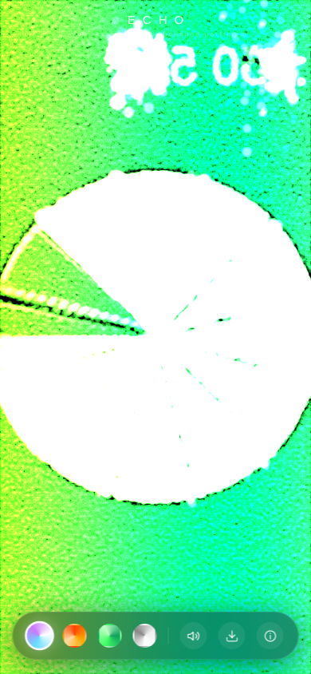

# ECHO — the particle mirror

**Your camera feed as ~100,000 GPU particles, in one self-contained HTML file.**
No libraries. No build step. No server — the feed never leaves your device.

**▶ Try it live: [trusch.github.io/echo](https://trusch.github.io/echo/)** — best on a phone, front camera, sound on.

<p align="center">
  
  <br>
  <em>Headless verification shot using Chromium's fake camera test pattern, software-rendered. A real face on a real GPU looks far better.</em>
</p>

## What it does

You see yourself as a hundred thousand particles of light. Each particle knows its home in the mirror; springs hold the image together — and everything you do tears it apart:

| Gesture | Effect |
|---|---|
| **Touch your reflection** | It scatters like dust from your fingertip, then finds its way back |
| **Drag** | Your finger drives a wind that smears the dust along its path |
| **Double-tap** | The whole mirror detonates in an expanding shell, then reassembles |
| **Wave your hand** (in front of the camera) | Optical flow — computed from the video itself — blows the particles around |

Four ways to be rendered: **Spectral** (true color + iridescence), **Ember**, **Matrix**, **Silver**.

## Privacy

The camera feed exists only as a GPU texture inside your browser. There is no server, no upload, no recording, no analytics — the page makes zero network requests. Close the tab and it's gone. (Don't take my word for it: it's one readable HTML file.)

## Under the hood

Everything lives in [`index.html`](index.html):

- **GPGPU particles** — particle state (offset + velocity per particle) lives in ping-ponged `RGBA16F` textures; a fragment shader integrates the physics each frame: spring-to-home forces, up to five simultaneous touch impulses (radial blast + drag wind), an expanding detonation shell, per-particle hash shimmer.
- **Optical flow** — a normal-flow approximation computed in the same shader from the current and previous video frames (temporal brightness difference × spatial gradient). Real-world motion becomes wind on the dust.
- **Rendering** — one `gl.POINTS` draw call of the whole grid; the vertex shader reads state via `texelFetch`, samples the mirrored camera texture at each particle's home for color, and sizes points by luminance and kinetic energy. Additive blending does the glow.
- **Sound** — an activity-gated pad (it fades out when you go idle), filtered-noise whooshes on touch, a sub-bass thump on detonation; raw oscillators and shaped noise through a runtime-generated convolution reverb, with the mobile AudioContext unlock dance.
- **Fallback** — no camera permission? A procedural ghost takes your place so the mirror still lives.

Requires WebGL2 (universal on phones of the last several years).

## Run it

```sh
# open directly
open index.html

# or serve it for your phone
python3 -m http.server 8080 --bind 0.0.0.0
```

Note: camera access requires a secure context — `https://` or `localhost`. The GitHub Pages link above just works.

## The origin story

Part of a series of single-prompt AI showcase apps. The challenge:

> "I want to test your capabilities. Create a mobile first webapp that shows what you are capable of and will blow not just my mind but anybody's mind. It should get millions of views if I posted a short video of it. This level of awesome. It should be a self contained webapp."

The first answer was [FLUX](https://github.com/trusch/flux); ECHO was idea #2 on the follow-up shortlist ("Build 1 and 2 independently as their own projects!"), picked because the viewer becomes the content — the most viral mechanic there is. Designed, written, and verified — headless Chromium with a fake camera device, CDP-driven screenshots — by **Claude** (Anthropic's `claude-fable-5` model, running as Claude Code).

Siblings: [FLUX](https://github.com/trusch/flux) (fluid dynamics + generative music) · [PORTAL](https://github.com/trusch/portal) (gyro-anchored raymarched dimension).

## License

[MIT](LICENSE)
